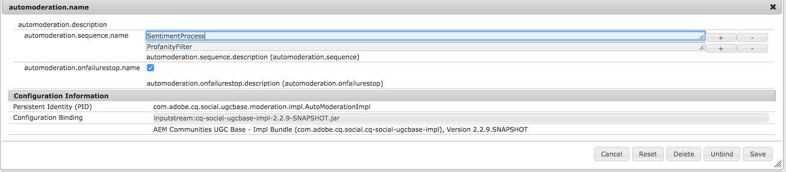

aem-scf-sample-components-extension
===================================

Sample package for AEM Social Communities - Social Component Framework (SCF).  Examples of extending Communities components to build a new social component.

building the sample
===================

* change directory to the root of the repository aem-scf-sample-watchwords-extension/bundles/aem-scf-extensions
* run *mvn clean install*
* a successful build should create a bundle artifact in *bundles/aem-scf-extensions* 

installing the sample
=====================

* use the OSGI System console at http://[server]/system/console/bundles and upload the jar file found at *bundles/aem-scf-extensions/target*
* configure the AutoModeration component at http://[server]/system/console/configMgr - Search for automoderation
* Add ProfanityFilter in the list of Automoderaion Sequences

 

